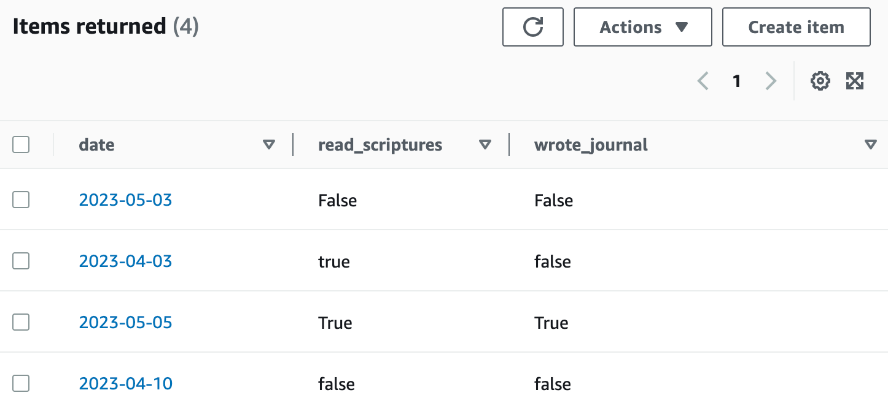

# Overview

The purpose of this *Cloud Goal Tracker* program is to help you to achieve your goals through gamification (turning your goals into a game). This software retrieves information saved in a cloud database and shows the history of achievements, or you can update/modify new goals achieved from the terminal of your local computer.

For new users, the software will ask them to register a username and password. For old users, a login process will be required to grant access to the main interface of this program. From the interface, you are allowed to connect to a cloud database to perform visualizations and updating tasks by just following the program prompts.

A demonstration of the software running and a walkthrough of the code can be found [here]().

Detailed specifications of this program can be found [here](specifications.md).


# How to use it

Clone this repository:

```ShellSession
$ git clone https://github.com/chinchay/cloud-goal-tracker.git
```

After accessing the directory, run the code by typing on the terminal:

```ShellSession
$ python app.py
```

and the following will be shown:

```ShellSession
Wellcome to Cloud Goal Tracker
==============================
LOGIN INTERFACE
==============================

1. Log in
2. Sign up
3. Exit

Choose an option:
```

If successfully loged in:

```ShellSession
Wellcome to Cloud Goal Tracker
==============================

1. Visualize goals history
2. Add or modify item
3. Delete item
Choose an option:
```


# Cloud Database

This software uses an [AWS DynamoDB database](https://us-east-2.console.aws.amazon.com/dynamodbv2/home?region=us-east-2#service) which is a NoSQL database service. This database was the preferred choice due to its database enhanced security, the possibility of smooth scaling, and quick start compared to other cloud databases. 

DynamoDB is based on a key-value structure for querying purposes. Once a connection is established to the cloud database, retrieving specific elements can be achieved by specifying the primary key, as implemented in the [`Database` class](Database.py).

The database structure can contain several tables, which can group attributes (columns) and items (rows). A sample table with two attributes (or "daily goals" for this Goal Tracker program) is shown below.




# Development Environment
* Git / GitHub
* Visual Studio Code
* Python 3.10.5
* [Boto3 package](https://github.com/boto/boto3)


# Useful Websites
* [Simple authentication](https://medium.com/@moinahmedbgbn/a-basic-login-system-with-python-746a64dc88d6)
* [Amazon DynamoDB database](https://us-east-2.console.aws.amazon.com/dynamodbv2/home?region=us-east-2#service)
* [DynamoDB operations performed locally](https://www.youtube.com/watch?v=Al1xwYhQ-BM&ab_channel=SoumilShah)

# Future Work
* Modify the program so that the user can define other goals different from the two ones provided in the current version (see figure above)
* Use a more robust authentication process. Kerberos is a possible choice
* Improve visualizations with cleaner plots
* Build a more friendly interface
* Implement a web-based interface
* Include other features. Example: Earning points whenever five goals were achieved
* Implement a script in the DynamoDB database to send notifications
* Load this code into a server to receive such notifications and perform other tasks
* Implement a mobile version of the current software